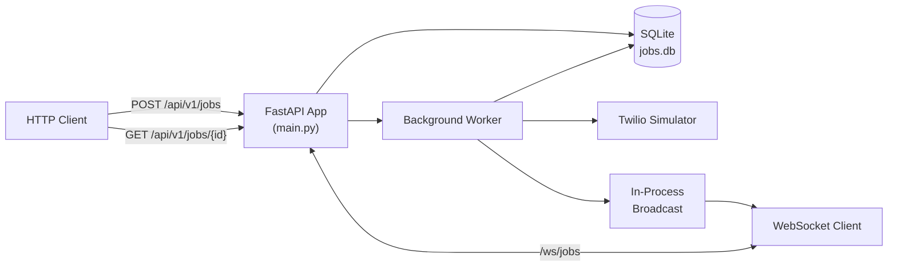

# Telephony Job Scheduler Service

A production-oriented reference implementation for scheduling outbound telephony jobs asynchronously, tracking their execution lifecycle, and streaming real-time status updates to connected clients.

Built with FastAPI, SQLite, and WebSockets, this project demonstrates how to separate job submission from background job execution - a common architecture pattern used in systems that handle phone calls, SMS notifications, voice alerts, or other asynchronous communication workflows at scale.

The service is designed to showcase practical backend patterns such as background task processing, real-time event updates, persistent job tracking, and scalable API design without blocking incoming client requests.

---

## Table of Contents

- [Problem Statement](#problem-statement)
- [Solution](#solution)
- [Who Is This For?](#who-is-this-for)
- [Key Features](#key-features)
- [Architecture](#architecture)
- [Tech Stack](#tech-stack)
- [Prerequisites](#prerequisites)
- [Getting Started](#getting-started)
- [API Reference](#api-reference)
- [Real-Time Updates](#real-time-updates)
- [Configuration](#configuration)
- [Running Tests](#running-tests)
- [Project Structure](#project-structure)
- [Security](#security)
- [Troubleshooting](#troubleshooting)

---

## Problem Statement

Outbound telephony operations - appointment reminders, OTP delivery, payment alerts, support callbacks - share a common challenge:

> **Making a phone call is slow and unreliable.** A single call can take several seconds, may fail due to network issues, and must never block the HTTP request that triggered it.

Without a job scheduler, applications typically suffer from:

| Problem | Impact |
|---|---|
| Synchronous call execution | API timeouts, poor user experience |
| No job persistence | Lost work on server restart |
| No status visibility | Clients cannot track call progress |
| No retry logic | Transient failures become permanent |
| No concurrency control | Unbounded parallel calls overwhelm providers |

This project solves these problems with a lightweight, self-contained job queue and real-time notification layer.

---

## Solution

The Telephony Job Scheduler Service accepts job requests over HTTP, persists them immediately, and processes them in a background worker. Clients can poll for status or subscribe to live updates via WebSocket.

```
Client submits job  →  Job queued in DB  →  Worker picks up job
                                                    ↓
Client receives WS update  ←  Status broadcast  ←  Simulated call completes
```

Jobs move through a well-defined lifecycle:

```
queued → claimed → processing → completed
                              ↘ failed (after retries)
```

The included Twilio simulator stands in for a real telephony provider (Twilio, Vonage, etc.), making the project runnable without external API credentials.

---

## Who Is This For?

This repository is useful if you are:

- **Building a notification platform** and need a reference for async job processing with status tracking
- **Integrating Twilio or similar APIs** and want to see how to isolate slow I/O from your HTTP layer
- **Learning FastAPI production patterns** - lifespan hooks, background workers, WebSocket broadcast, API versioning, and structured configuration
- **Onboarding engineers** who need a small, complete system to study before extending it for production

### Example Use Cases

| Use Case | How This Service Helps |
|---|---|
| Appointment reminders | Queue thousands of calls without blocking the booking API |
| OTP / 2FA voice delivery | Retry failed calls automatically with exponential backoff |
| Operations dashboards | Stream live job status to a frontend via WebSocket |
| Microservice template | Fork and swap the simulator for a real telephony SDK |

---

## Key Features

- **Async job queue** - submit jobs instantly; processing happens in the background
- **Real-time WebSocket updates** - clients receive `processing` and `completed` events without polling
- **Atomic job claiming** - prevents duplicate processing under concurrent workers
- **Configurable concurrency** - bounded parallel execution via semaphore
- **Automatic retries** - exponential backoff on transient failures
- **API key authentication** - protects the scheduling endpoint
- **Rate limiting** - 10 requests/minute per client IP on job creation
- **Input validation & sanitization** - Pydantic v2 validators with HTML escaping
- **Health check endpoint** - ready for Docker, Kubernetes, and load balancers
- **Fully tested** - unit and integration test suite included
- **Docker-ready** - single-container deployment with persistent volume

---

## Architecture



**Design decisions:**

- HTTP and WebSocket run in a **single process** on port `8000`, eliminating inter-service complexity.
- Job updates are broadcast **in-process** to connected WebSocket clients - no message broker required at this scale.
- SQLite with WAL mode provides durable persistence without external database infrastructure.
- Configuration is fully **environment-driven** via `pydantic-settings`.

---

## Tech Stack

| Layer | Technology |
|---|---|
| API Framework | FastAPI 0.115 |
| ASGI Server | Uvicorn |
| Database | SQLite (aiosqlite) |
| Validation | Pydantic v2 |
| Rate Limiting | SlowAPI |
| Real-Time | WebSockets (Starlette) |
| Testing | pytest + httpx |
| Containerization | Docker + Docker Compose |

---

## Prerequisites

- **Docker** and **Docker Compose** (recommended), or
- **Python 3.11+** with `pip` for local development

---

## Getting Started

### 1. Clone and configure

```bash
git clone <repository-url>
cd telephony-job-scheduler-service

cp .env.example .env
```

Open `.env` and set your API key to any secret string you choose:

```env
API_KEY=your-secret-key-here
```

> **Important:** The API key is not fetched from any external service - you define it yourself in `.env`. After changing it, restart the container.

### 2. Start with Docker

```bash
docker compose up --build
```

The service will be available at **http://localhost:8000**.

### 3. Verify the service is healthy

```bash
curl http://localhost:8000/health
```

Expected response:

```json
{"status": "ok", "service": "telephony-job-scheduler"}
```

### 4. Local development with hot reload

```bash
docker compose -f docker-compose.yml -f docker-compose.dev.yml up --build
```

### 5. Local development without Docker

```bash
python3 -m venv .venv
source .venv/bin/activate
pip install -r requirements.txt
cp .env.example .env

uvicorn app.main:app --reload --port 8000
```

---

## API Reference

All HTTP endpoints require the `X-API-Key` header matching the value set in your `.env` file.

Interactive documentation is available at [http://localhost:8000/docs](http://localhost:8000/docs).

### `POST /api/v1/jobs` - Schedule a job

Submit a new telephony job to the queue.

**Request:**

```bash
curl -X POST http://localhost:8000/api/v1/jobs \
  -H "Content-Type: application/json" \
  -H "X-API-Key: your-secret-key-here" \
  -d '{"phone_number": "1234567890", "message": "Hello User"}'
```

**Response `200 OK`:**

```json
{
  "job_id": 1,
  "status": "queued",
  "created_at": "2026-05-26 12:00:00",
  "updated_at": "2026-05-26 12:00:00"
}
```

**Validation rules:**

| Field | Rule |
|---|---|
| `phone_number` | 10–15 digits, optional leading `+` |
| `message` | Non-empty after trimming, HTML-escaped before storage |

**Error responses:**

| Status | Cause |
|---|---|
| `403` | Missing or incorrect `X-API-Key` |
| `422` | Invalid phone number or empty message |
| `429` | Rate limit exceeded (10 requests/minute) |
| `500` | Internal server error |

---

### `GET /api/v1/jobs/{job_id}` - Retrieve job status

Poll the current state of a previously submitted job.

```bash
curl http://localhost:8000/api/v1/jobs/1 \
  -H "X-API-Key: your-secret-key-here"
```

**Response `200 OK`:**

```json
{
  "id": 1,
  "phone_number": "1234567890",
  "message": "Hello User",
  "status": "completed",
  "created_at": "2026-05-26 12:00:00",
  "updated_at": "2026-05-26 12:00:05"
}
```

**Response `404`:** Job ID does not exist.

---

### `GET /health` - Health check

No authentication required. Used by Docker and orchestrators.

```bash
curl http://localhost:8000/health
```

---

## Real-Time Updates

Connect to the WebSocket endpoint to receive live job status events without polling.

**Endpoint:** `ws://localhost:8000/ws/jobs`

**Message format:**

```
Job 1 status: processing
Job 1 status: completed
```

### Sample WebSocket client

Open a second terminal while the service is running:

```bash
python app/client/ws_client.py
```

Then submit a job from another terminal. You will see status updates appear in real time:

```
Connected to WebSocket server at ws://localhost:8000/ws/jobs
Received: Job 1 status: processing
Received: Job 1 status: completed
```

> WebSocket connections do not require an API key. Only the HTTP scheduling endpoints are authenticated.

---

## Configuration

All settings are loaded from environment variables or a `.env` file in the project root.

| Variable | Default | Description |
|---|---|---|
| `API_KEY` | `changeme` | Secret key for HTTP API authentication |
| `DB_PATH` | `./app/db/jobs.db` | SQLite database file path |
| `LOG_LEVEL` | `INFO` | Logging verbosity (`DEBUG`, `INFO`, `WARNING`, `ERROR`) |
| `MAX_CONCURRENT_JOBS` | `5` | Maximum jobs processed in parallel |
| `MAX_JOB_RETRIES` | `3` | Retry attempts before marking a job as failed |
| `WORKER_POLL_INTERVAL` | `5.0` | Seconds between queue polls |

> **Note:** After modifying `.env`, restart the service for changes to take effect:
> ```bash
> docker compose down && docker compose up --build
> ```

---

## Running Tests

```bash
python3 -m venv .venv
source .venv/bin/activate
pip install -r requirements.txt

PYTHONPATH=. pytest -v
```

The test suite covers:

- Pydantic input validation and sanitization
- Database operations and atomic job claiming
- Worker processing, retries, and failure handling
- HTTP API endpoints (auth, validation, CRUD)
- WebSocket broadcast on job completion

---

## Project Structure

```
telephony-job-scheduler-service/
├── app/
│   ├── main.py                 # Application entry point and lifespan
│   ├── config.py               # Environment-driven settings (pydantic-settings)
│   ├── api/
│   │   ├── routes.py           # HTTP routes - POST/GET /api/v1/jobs
│   │   └── ws.py               # WebSocket endpoint - /ws/jobs
│   ├── client/
│   │   └── ws_client.py        # Sample WebSocket consumer
│   ├── core/
│   │   ├── broadcast.py        # Thread-safe in-process WebSocket broadcast
│   │   ├── worker.py           # Background job processor with retry logic
│   │   ├── websocket.py        # Job update notification helper
│   │   └── twilio_simulator.py # Stand-in for a real telephony provider
│   └── db/
│       └── db.py               # SQLite persistence with WAL mode
├── tests/
│   ├── unit/                   # Validators, DB, worker logic
│   └── integration/            # HTTP API and WebSocket end-to-end
├── docker-compose.yml          # Production container setup
├── docker-compose.dev.yml      # Dev overrides (hot reload, bind mount)
├── Dockerfile
├── requirements.txt            # Pinned dependencies
├── .env.example
└── README.md
```

---

## Security

| Control | Implementation |
|---|---|
| Authentication | API key via `X-API-Key` header on all HTTP endpoints |
| Rate limiting | 10 job submissions per minute per IP |
| Input validation | Pydantic v2 field validators on all request bodies |
| Output sanitization | HTML escaping on message content before storage |
| Container hardening | Non-root user in Docker image |
| Secrets management | `.env` file excluded from version control |

For production deployments, additionally consider:

- TLS termination (nginx, Traefik, or cloud load balancer)
- Rotating API keys via a secrets manager
- Migrating from SQLite to PostgreSQL for horizontal scaling
- Replacing the Twilio simulator with the official Twilio SDK

---

## Troubleshooting

| Symptom | Likely Cause | Fix |
|---|---|---|
| `403 Invalid or missing API key` | Header value doesn't match `.env` | Ensure `X-API-Key` matches `API_KEY` in `.env`, then restart Docker |
| `403` after changing `.env` | Container still running with old env | Run `docker compose down && docker compose up --build` |
| WebSocket connection refused | Service not running | Confirm `docker compose up` is active and port 8000 is free |
| Job stays `queued` | Worker not running | Check container logs: `docker compose logs -f` |
| `Connection refused` on port 8000 | Container not started | Run `docker compose up --build` from the project directory |

---

## License

This project is provided as a reference implementation for educational and development purposes.
